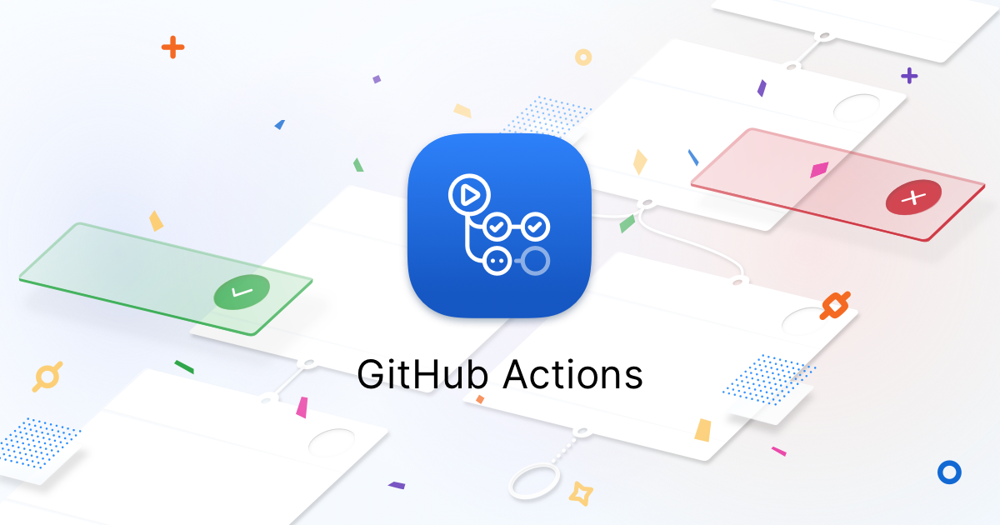

footer: @as_w | aaronmsft.com | aka.ms/reactor-toronto
theme: Zurich

# Kubernetes & Cloud Native Developer Tooling

 
 
 
 
Aaron Wislang
Senior Cloud Advocate, Microsoft
Open Source | Go, Python, Containers, Kubernetes, ...

---

# GitHub Actions

## github.com/features/actions

*Automate your workflow from idea to production*

---

# Virtual Kubelet

## virtual-kubelet.io | github.com/virtual-kubelet/virtual-kubelet

*Allows Kubernetes nodes to be backed by Virtual Kubelet providers such as serverless cloud container platforms*

---

# Kubernetes-based Event Driven Autoscaling (KEDA)

## github.com/kedacore/keda

*Event driven scale for any container running in Kubernetes*

---

# Kubernetes Horizontal Pod Autoscaler (HPA)

## kubernetes.io | github.com/kubernetes/kubernetes

### https://kubernetes.io/docs/tasks/run-application/horizontal-pod-autoscale/

*Automatically scales the number of pods in a replication controller, deployment or replica set*

---

# Brigade

## brigade.sh | github.com/brigadecore/brigade

*Event-driven scripting for Kubernetes.*

^
Event-driven scripting for Kubernetes -- "Brigade is a tool for running scriptable, automated tasks in the cloud — as part of your Kubernetes cluster."

---

# Helm

## helm.sh | github.com/helm/helm

*The package manager for Kubernetes*

---

# Kubeflow

## kubeflow.org | github.com/kubeflow/kubeflow

*Makes deployments of machine learning (ML) workflows on Kubernetes simple, portable and scalable.*

---

# Thank you!

- Questions, feedback, next steps?
- More: aka.ms/reactor-toronto
- Contact: aaronmsft.com, twitter (@as_w), linkedin, ...

 
Aaron Wislang
Senior Cloud Advocate, Microsoft
Open Source | Go, Python, Containers, Kubernetes, ...
